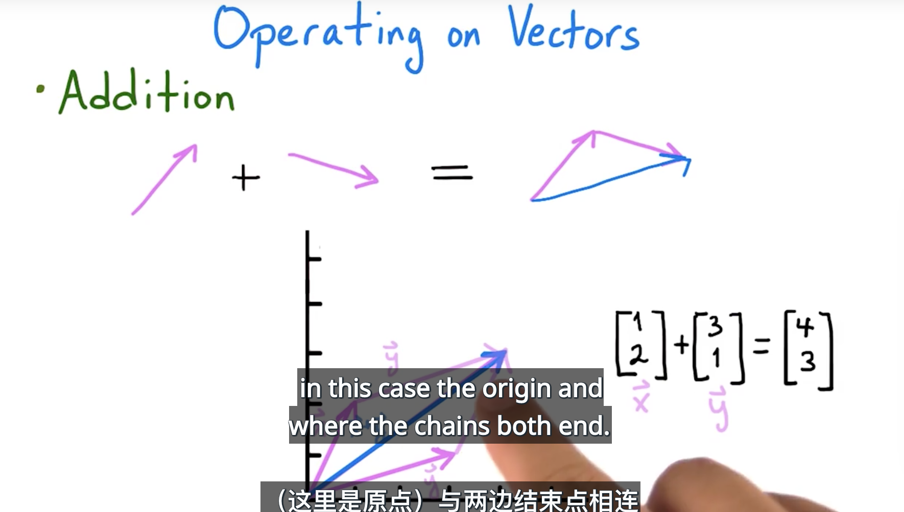
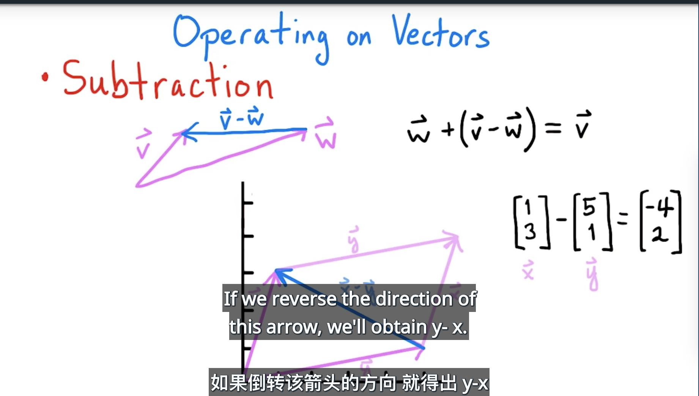
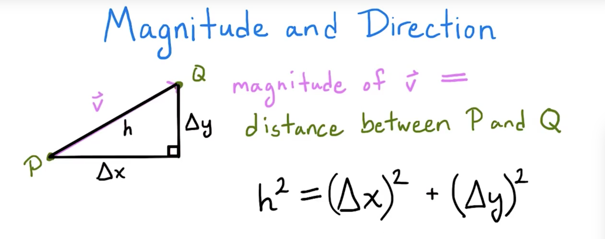
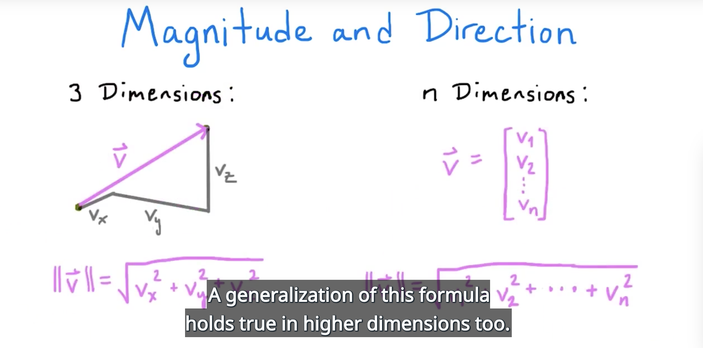
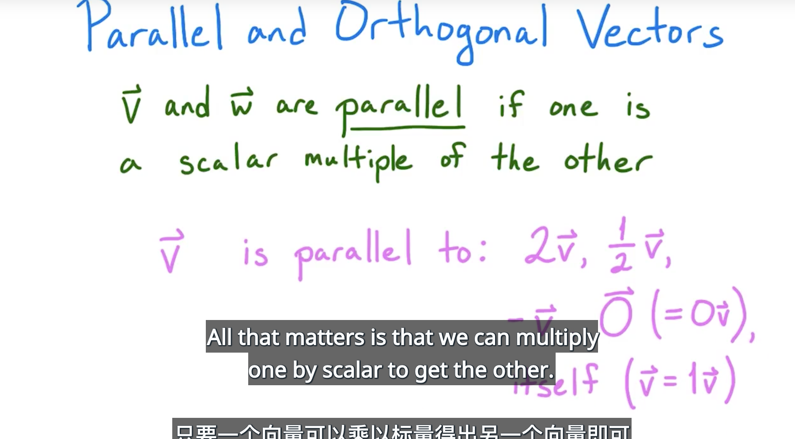
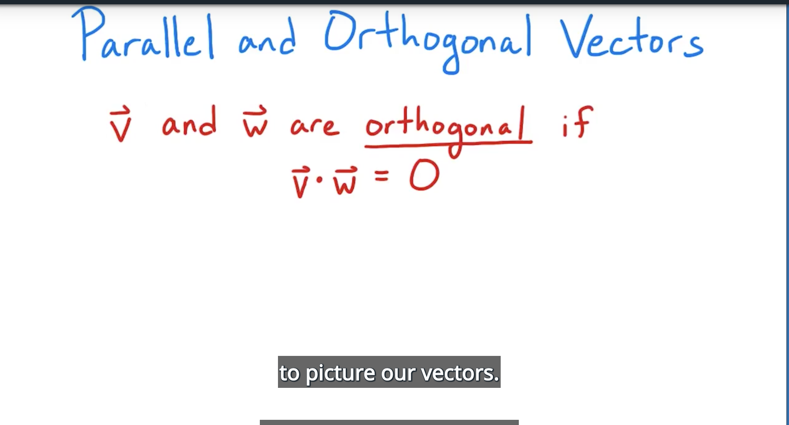

# Operating on Vectors 

- Addition 

- Subtraction

- Scalar multiplication
 

# Magintude and Direction
- Magintude

- Direction

- Normalization
    给向量找到单元向量叫标准化(0没有标准化向量)

- Inner Products

- Parallel and Orthogonal Vectors 

    零向量是所有向量即平行又相交的向量

- Projecting Vectors

- Cross Products 
    - another form of vector multiplicatino
    - only exists in three dimensions(no higher-dimensional version)

